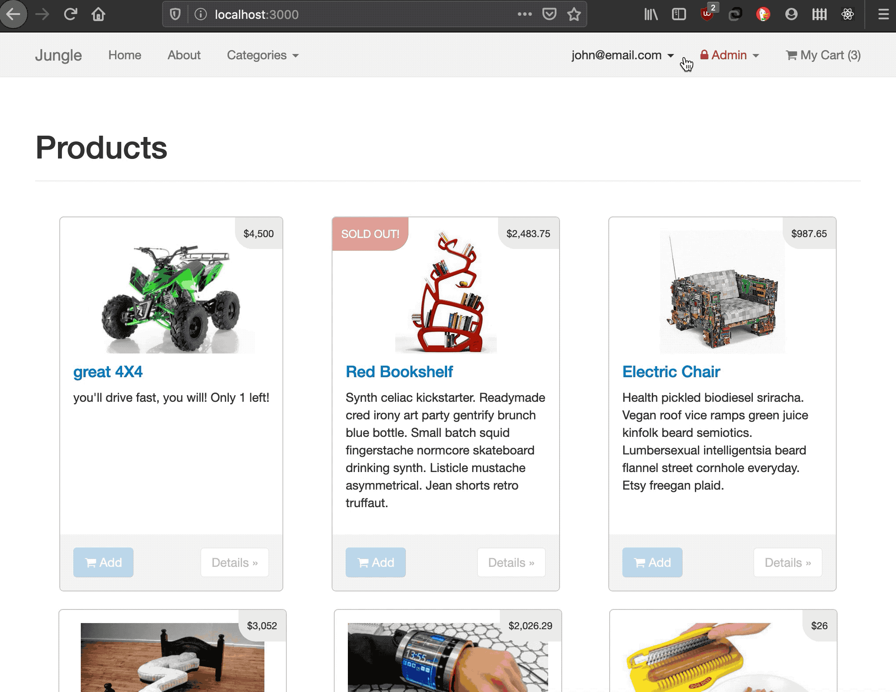

# Jungle

A mini e-commerce application built with Rails 4.2. Using Stripe to order items and "make payments". Model and Feature testing is done with Rspec. Also using basic http authentication in ruby to secure the "admin" side the site. With successful login admins can create new catagories and products and save them to the database.

## The Product

Navigating the site, and adding items to the cart.

Accessing the Admin side of the site.

## Setup

1. Run `bundle install` to install dependencies
2. Create `config/database.yml` by copying `config/database.example.yml`
3. Create `config/secrets.yml` by copying `config/secrets.example.yml`
4. Run `bin/rake db:reset` to create, load and seed db
5. Create .env file based on .env.example
6. Sign up for a Stripe account
7. Put Stripe (test) keys into appropriate .env vars
8. Run `bin/rails s -b 0.0.0.0` to start the server

## Stripe Testing

Use Credit Card # 4111 1111 1111 1111 for testing success scenarios.

More information in their docs: <https://stripe.com/docs/testing#cards>

## Dependencies

* Rails 4.2 [Rails Guide](http://guides.rubyonrails.org/v4.2/)
* PostgreSQL 9.x
* Stripe

## Known bugs, limitations, and future goals

* basic http authentication does little to handle incorrect login credentials when a user tries to access the Admin side. This could be imporved
* The admin "dashboard" is accessible to all users, it should be secured as well
* Stretch goals include emailing a receipt to the customer, and adding ratings to products
